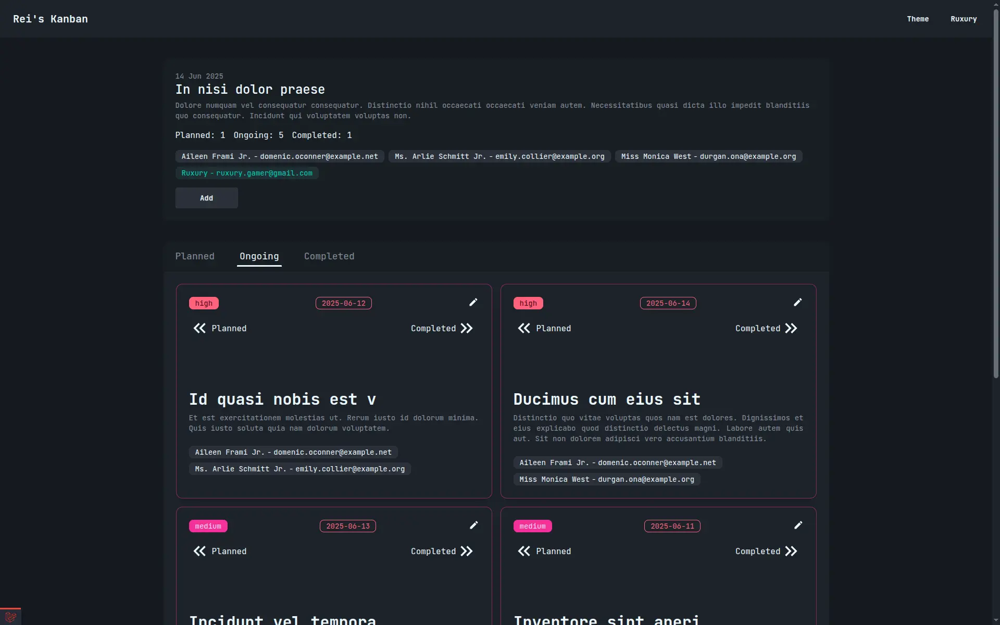

# Rei's Kanban

Rei's Kanban is a web-based kanban board application that helps users organize tasks and manage projects efficiently. Built with Laravel and modern web technologies, it provides a responsive and intuitive interface for task management.



## Demo

You can try a live demo of the kanban app here: [https://kanban.reishandy.my.id](https://kanban.reishandy.my.id)

## Features

- **Intuitive Kanban Interface:** Easily organize tasks across customizable columns
- **Task Management:** Create, update, and delete tasks with rich details
- **User Authentication:** Secure login and registration system with email verification
- **Mobile Responsive:** Works seamlessly across devices of all sizes
- **Project Collaboration:** Share boards with team members and collaborate on tasks

## Technology Stack

- **Backend:** PHP with Laravel framework
- **Frontend:** Blade templates with JavaScript
- **Package Management:** Composer (PHP) and NPM (JavaScript)
- **Database:** MySQL/PostgreSQL (configure as needed)
- **Styling:** Tailwind and DaisyUI with responsive design principles

## Installation

### Prerequisites

- PHP 8.1+
- Composer
- Node.js and NPM
- MySQL or PostgreSQL database

### Setup Steps
1. **Clone the Repository:**

   ```bash
   git clone https://github.com/Reishandy/reis-kanban.git
   cd reis-kanban
   
2. **Install PHP Dependencies:**

   ```bash
    composer install
    ```
   
3. **Install JavaScript Dependencies:**

   ```bash
   npm install
   ```
4. **Configure Environment:**

   Copy the `.env.example` file to `.env` and update the database connection settings:

   ```bash
   cp .env.example .env
   php artisan key:generate
   ```
   
5. **Run Migrations:**

   ```bash
    php artisan migrate
    ```
   
6. **Compile Assets:**

   ```bash
   npm run dev
   ```
   
7. **Start the Development Server:**

   ```bash
    php artisan serve
    ```
   
8. **Access the Application:**
    Open your browser and go to `http://localhost:8000` to see the kanban board in action.

## Usage
1. Register a new account or log in with existing credentials
2. Create a new kanban board for your project
3. Create and organize tasks by moving them between columns
4. Collaborate with team members by sharing your board

## Development
For production builds, use the following command to compile assets:

```bash
npm run build
```

> **Note:** Make sure to set the APP_DEBUG to `false` in the `.env` file for production environments.

## Contributing

Contributions are welcome! If you have ideas for new features or improvements, please fork the repository and create a pull request.

## 📄 License

This project is licensed under the AGPL-3.0 License - see the [LICENSE](LICENSE) file for details.

## 🙏 Credits

Created by [Reishandy](https://github.com/Reishandy)
